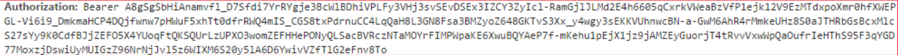

# 🔒Autenticação

A autenticação da API é realizada por meio de um token Bearer, que não expira.

Cada ambiente, seja de desenvolvimento ou produção, possui seus próprios tokens exclusivos.

⚠️ **Ao iniciar o processo de integração, solicite o token à equipe de integração.**
